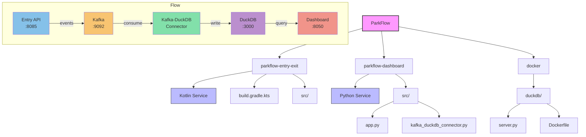

# ParkFlow Project Structure

## Components

1. **Entry API** (`:8085`): Receives vehicle entry events
2. **Kafka** (`:9092`): Message broker for event streaming
3. **Kafka-DuckDB Connector**: Consumes events and writes to DuckDB
4. **DuckDB** (`:3000`): Analytics database
5. **Dashboard** (`:8050`): Real-time visualization
