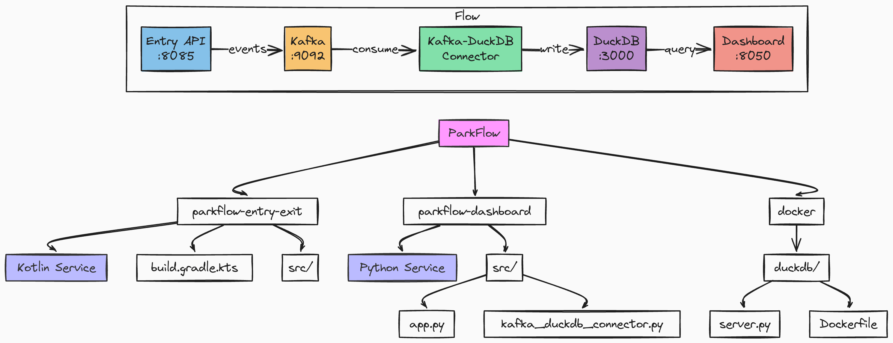

= ParkFlow
:toc: macro
:toc-title: Table of Contents
:toclevels: 3

[.lead]
PARKFLOW™ (Parking Analytics & Real-time Knowledge Framework for Live Operations Window).

Real-time parking management system with stream processing and analytics capabilities.

WARNING: Not an actual system, just a demo of integrating a bunch of technologies of Modern Data Stack – Kafka for Streaming, DuckDB for Analytics, Plotly/Dash for visualisation.

== Quick Start
[source,bash]
----
# Clone and start the project
git clone https://github.com/yourusername/parkflow.git
cd parkflow
make install  # Install dependencies
make start   # Start all services

# Send some test events
make simulate EVENTS=20 DELAY=500

# Open dashboard
open http://localhost:8050
----

toc::[]

== About ParkFlow

ParkFlow is a modern parking management system designed to handle real-time vehicle entry/exit events, process payments, and provide instant analytics.

Key features:

* Real-time vehicle detection and entry/exit management
* Stream processing of parking events using Kafka Streams and Apache Flink
* Analytics dashboard with DuckDB for quick insights
* Scalable microservices architecture using Kotlin and Python
* Modern web interface built with Plotly Dash

== Project Structure

Each component is designed to be independent and scalable.
The system follows modern microservices architecture principles.
All services communicate through well-defined APIs and event streams.

[cols="3"]
|===
|Module |Status |Description

|`parkflow-common`
|🟢 Ready
|Shared models and utilities.
This module contains code used across multiple services.

|`parkflow-entry-exit`
|🟢 Ready
|Gate control service.
Manages vehicle entry and exit points.

|`parkflow-dashboard`
|🟢 Ready
|Plotly Dash UI.
Provides real-time visualization and monitoring.

|`parkflow_cli`
|🟢 Ready
|Command Line Interface.
Provides development tools and utilities.

|`parkflow-stream`
|🟡 In Progress
|Kafka Streams processor.
Handles real-time event processing and state updates.

|`parkflow-analytics`
|🟡 In Progress
|DuckDB analytics engine.
Provides fast analytical queries and insights.

|`parkflow-flink`
|🔴 Not Started
|Flink processor implementation.
Provides advanced stream processing capabilities.

|`parkflow-payment`
|🔴 Not Started
|Payment processing service.
Handles all financial transactions.

|`parkflow-gateway`
|🔴 Not Started
|API Gateway.
Routes requests and handles service discovery.
|===

== Technology Stack

=== JVM Services
* Kotlin with Gradle (Kotlin DSL)

=== Python Services
* Python 3.11+ with UV package manager

=== Stream Processing
* Kafka Streams 3.6.1
* Apache Flink 1.19

=== Services & Analytics
* REST Services: FastAPI
* Analytics: DuckDB
* Dashboards: Plotly/Dash
* Event Schemas: Apache Avro

=== Testing
* JVM: Kotest with TestContainers
* Python: pytest with pytest-asyncio
* Coverage minimum: 80%

== Event Schema and Flow

=== Event Types

==== VehicleEntryEvent
Records vehicle entry into parking facility:

* Unique event ID and timestamp
* License plate and recognition confidence
* Gate and lane identifiers
* Optional vehicle image URL
* Vehicle type (CAR, MOTORCYCLE, TRUCK)

==== PaymentEvent
Records parking payment transactions:

* Unique event and transaction IDs
* License plate reference
* Amount and currency
* Payment method (CREDIT_CARD, DEBIT_CARD, MOBILE_PAYMENT, CASH)
* Payment status (PENDING, COMPLETED, FAILED, REFUNDED)
* Parking duration

==== VehicleExitEvent
Records vehicle exit from parking facility:

* Unique event ID and timestamp
* License plate and recognition confidence
* Gate and lane identifiers
* Reference to entry event
* Optional vehicle image URL

=== Event Flow Logic

The system generates events following a strict sequence:

. *Vehicle Entry*
** Generated when capacity allows
** More frequent during peak hours (8-9 AM, 4-5 PM)
** Less frequent during quiet periods (11 PM - 5 AM)

. *Payment Processing*
** Occurs after minimum 5-minute stay
** 85% of sessions require payment
** Payment amount based on duration (base $2 + $3/hour, max $25)
** Payment methods distribution:
*** Credit Card: 70%
*** Debit Card: 25%
*** Cash: 5%

. *Vehicle Exit*
** Generated after payment completion (if required)
** Must reference original entry event
** Completes the parking session

=== Stay Duration Patterns

* Quick stops: 5-15 minutes (10% of sessions)
* Shopping: 1-3 hours (60% of sessions)
* Work/Long-term: 8-10 hours (30% of sessions)

=== Traffic Patterns

* Peak Hours (8-9 AM, 4-5 PM)
** 80% chance of new entry
** 6-12 second intervals

* Normal Hours
** 30% chance of new entry
** 20-60 second intervals

* Quiet Period (11 PM - 5 AM)
** 10% chance of new entry
** 10-15 minute intervals

== Analytics Service (DuckDB)

The analytics service provides a REST API for querying and analyzing parking data using DuckDB.

=== API Endpoints

[cols="2,1,2"]
|===
|Endpoint |Method |Description

|`/health`
|GET
|Check service health

|`/query`
|POST
|Execute SQL queries

|`/upload`
|POST
|Upload CSV files to DuckDB tables

|`/tables`
|GET
|List available tables

|`/schema/{table_name}`
|GET
|Get schema for a specific table

|`/analyze/{table_name}`
|POST
|Get basic statistics for a table
|===

=== Example Usage

.Check service health
[source,bash]
----
curl http://localhost:3000/health
----

.Execute a SQL query
[source,bash]
----
curl -X POST http://localhost:3000/query \
  -H "Content-Type: application/json" \
  -d '{"query": "SELECT * FROM parking_events LIMIT 5"}'
----

.Upload a CSV file
[source,bash]
----
curl -X POST http://localhost:3000/upload \
  -F "file=@data.csv" \
  -F "table_name=parking_events"
----

.Get table schema
[source,bash]
----
curl http://localhost:3000/schema/parking_events
----

.Get table statistics
[source,bash]
----
curl -X POST http://localhost:3000/analyze/parking_events \
  -H "Content-Type: application/json" \
  -d '{"columns": ["duration", "amount"]}'
----

=== Docker Configuration

The DuckDB service is containerized using Docker with the following features:

* Uses official DuckDB binary (v1.1.0)
* FastAPI-based REST interface
* Persistent storage in `/data/analytics.db`
* Health monitoring
* CORS support for web clients

=== Environment Variables

[cols="1,2"]
|===
|Variable |Description

|`DUCKDB_DATABASE`
|Path to DuckDB database file (default: `/data/analytics.db`)

|`PYTHONUNBUFFERED`
|Python output buffering (set to 1 for immediate logs)
|===

== Development Setup

=== Prerequisites

* JDK 17+
* Python 3.11+
* Docker and Docker Compose
* UV package manager

=== Building the Project

.JVM services
[source,bash]
----
./gradlew build
----

.Python services
[source,bash]
----
uv venv
source .venv/bin/activate
uv pip install -r requirements.txt
----

=== Running Infrastructure

[source,bash]
----
docker-compose up -d
----

== Testing

.JVM Services
[source,bash]
----
./gradlew test
----

.Python Services
[source,bash]
----
pytest
----

[NOTE]
====
Coverage reports will be generated in:

* JVM services: `build/reports`
* Python services: `.coverage`
====

== Running the Applications

=== Prerequisites

* Java 17 or higher
* Docker and Docker Compose
* Gradle 8.x

=== Running parkflow-entry-exit

==== Local Development

To run the application locally with default settings:

[source,bash]
----
./gradlew parkflow-entry-exit:run
----

This will use the following default configuration:

* Kafka Bootstrap Servers: localhost:29092
* Schema Registry URL: http://localhost:8081
* Application Port: 8085
* Host: 0.0.0.0

==== Environment Variables

You can customize the application behavior using environment variables:

[cols="1,1,1"]
|===
|Variable |Description |Default Value

|KAFKA_BOOTSTRAP_SERVERS
|Comma-separated list of Kafka brokers
|localhost:29092

|KAFKA_TOPIC
|Name of the Kafka topic
|parking.entry.events

|SCHEMA_REGISTRY_URL
|URL of the Schema Registry
|http://localhost:8081

|PORT
|Application port
|8085

|HOST
|Application host
|0.0.0.0
|===

==== Running with Different Profiles

Use the provided script to set environment variables for different profiles:

[source,bash]
----
# For local development
source ./scripts/set-profile.sh local

# For cloud deployment
source ./scripts/set-profile.sh cloud
----

==== Testing the Application

===== Single Event

[source,bash]
----
curl -X POST http://localhost:8085/api/v1/entry/event
----

===== Simulation

[source,bash]
----
curl -X POST http://localhost:8085/api/v1/entry/simulate \
  -H "Content-Type: application/json" \
  -d '{"numberOfEvents": 10, "delayBetweenEventsMs": 1000}'
----

=== Infrastructure Services

The application requires the following services that are defined in docker-compose.yml:

* Kafka (apache/kafka:3.8.0)
** Running in Kraft mode
** External port: 29092
** Internal port: 9092

* Schema Registry (confluentinc/cp-schema-registry:7.8.0)
** Port: 8081
** Depends on Kafka

* DuckDB Analytics
** Port: 3000
** Mounted volume: ./data

=== Troubleshooting

==== Common Issues

1. Port Already in Use
+
[source,bash]
----
lsof -i :8085  # Check if port 8085 is in use
kill -9 <PID>  # Kill the process if needed
----

2. Kafka Connection Issues
+
[source,bash]
----
# Check if Kafka is running
docker compose ps

# Check Kafka logs
docker compose logs kafka

# Restart Kafka
docker compose restart kafka
----

3. Schema Registry Issues
+
[source,bash]
----
# Check Schema Registry status
curl -X GET http://localhost:8081

# Check Schema Registry logs
docker compose logs schema-registry
----

=== Health Checks

The application provides health check endpoints:

* Kafka: Check via producer metrics
* Schema Registry: Available at http://localhost:8081/subjects
* Application: Main endpoint at http://localhost:8085/api/v1/entry/event

== Contributing

We welcome contributions!
Here's how you can help:

1. *Fork the Repository*
* Fork the repo on GitHub
* Clone your fork locally

2. *Create a Branch*
* Create a new branch for your feature
* Make your changes
* Write or update tests as needed

3. *Submit a Pull Request*
* Push your changes to your fork
* Submit a pull request to the main repository
* Describe your changes in detail
* Link any relevant issues

4. *Code Review*
* Wait for review from maintainers
* Make any requested changes
* Once approved, your PR will be merged

=== Development Guidelines

* Follow existing code style and conventions
* Write meaningful commit messages
* Add tests for new features
* Update documentation as needed
* Keep PRs focused and atomic

== License

This project is licensed under the MIT License.
See the link:LICENSE[LICENSE] file for details.

Copyright (c) 2024 Viktor Gamov
